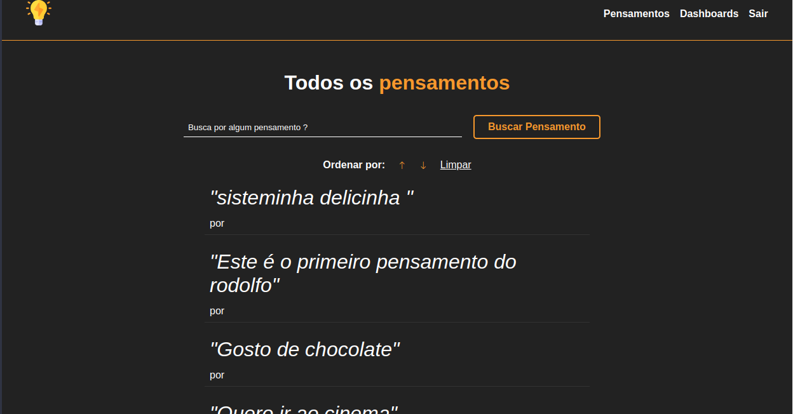

<h1 align="center">Thoughts</h1>

<p align="center">
  

  

  

  

</p>

<div align="center" id="top"> 
  

</div>


<p align="center">
  <a href="#dart-sobre">Sobre</a> &#xa0; | &#xa0; 
  <a href="#sparkles-funcionalidades">Funcionalidades</a> &#xa0; | &#xa0;
  <a href="#rocket-tecnologias">Tecnologias</a> &#xa0; | &#xa0;
  <a href="#white_check_mark-pré-requisitos">Pré requisitos</a> &#xa0; | &#xa0;
  <a href="#checkered_flag-começando">Começando</a> &#xa0; | &#xa0;
  <a href="#memo-licença">Licença</a> &#xa0; | &#xa0;
  <a href="https://github.com/Gabriel4420" target="_blank">Autor</a>
</p>

<br>

## :dart: Sobre

Projeto de conclusão de estudo do modulo de Handlebars do curso NodeJS do Zero a maestria, ministrado pelo docente Matheus Battisti, aonde é abordado conceitos de CRUD, além de ter como base a arquitetura MVC.

## :sparkles: Funcionalidades

:heavy_check_mark: Autenticação/login\
:heavy_check_mark: Logout\
:heavy_check_mark: Registrar usuário\
:heavy_check_mark: Criar Pensamento\
:heavy_check_mark: Visualizar Pensamento\
:heavy_check_mark: Editar Pensamento\
:heavy_check_mark: Deletar Pensamento\

## :rocket: Tecnologias

As seguintes ferramentas foram usadas na construção do projeto:

- [Node.js](https://nodejs.org/en/)
- [Handlebars](https://handlebarsjs.com/)
- [Express](https://expressjs.com/pt-br/)
- [Express-Flash](https://www.npmjs.com/package/express-flash)
- [Express-Session](https://www.npmjs.com/package/express-session)
- [Mysql](https://www.mysql.com/)
- [Sequelize](https://sequelize.org/)
- [session-file-store]( https://www.npmjs.com/package/session-file-store)
- [Bcrypt](https://www.npmjs.com/package/bcrypt)
- [connect-flash](https://www.npmjs.com/package/connect-flash)
- [cookie-parser](https://www.npmjs.com/package/cookie-parser)
- [cookie-session](https://www.npmjs.com/package/cookie-session)


## :white_check_mark: Pré requisitos

Antes de começar :checkered_flag:, você precisa ter o [Git](https://git-scm.com), [Node](https://nodejs.org/en/) e o [Yarn](https://yarnpkg.com/) instalados em sua maquina.

## :checkered_flag: Começando

```bash
# Clone este repositório
$ git clone https://github.com/Gabriel4420/thoughts

# Instale as dependências
$ yarn

# Para iniciar o projeto
$ yarn start

# O app vai inicializar em <http://localhost:3000>
```

## :memo: Licença

Este projeto está sob licença MIT. Veja o arquivo [LICENSE](LICENSE.md) para mais detalhes.

<h4 align="center">
  Feito com ❤️ por Gabriel Rodrigues 👋️ <a href="mailto:gabriel_rodrigues_perez@hotmail.com">Entre em contato!</a>
</h4>

<p align="center">

  <a href="https://www.linkedin.com/in/gabriel-rodrigues-perez-2069b072/">
    
  </a>
  <a href="https://www.facebook.com/gabriel.rodrigues.perez">
    
  </a>
  <a href="https://www.instagram.com/gabriel_rodrigues_perez/">
    
  </a>
  
  
</p>

&#xa0;

<a href="#top">Voltar para o topo</a>
